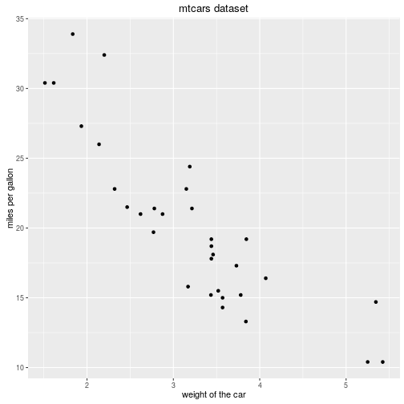
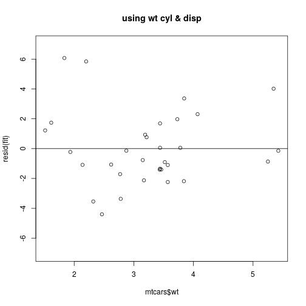

carplotter
========================================================
author: Gianluca Micchi
date: 19 October 2016
autosize: true

carplotter
========================================================

We are glad to introduce the amazing **carplotter** utility !

- see how much a car consume
- understand what influence its fuel consumption
- ... and experience the thrill of being a data scientist!

why have we done it?
========================================================
TO SAVE THE PLANET!
What should we improve to reduce fuel consumption? 



how it works
========================================================
we let you choose how to study the problem:
we are a tool, you are the scientist

we use an advanced statistical method called *residual plot* that you will be able to master thanks to the carplotter application


```r
featsLm <- rep(FALSE, 11)
for(feat in input$feats) featsLm <- featsLm + grepl(feat, names(mtcars))
featsLm <- which(featsLm==1)
if(is.null(input$feats)) {
        form <- mpg ~ wt
        } else {
        form <- as.formula(paste("mpg ~ wt+", paste(names(mtcars)[featsLm], collapse= "+")))
        }

fit <- lm(form, mtcars)
residuals <- resid(fit)
```

what you will see
========================================================


this for every set of features that you will decide to have.
and you will obtain also a measure of the residual variance!
